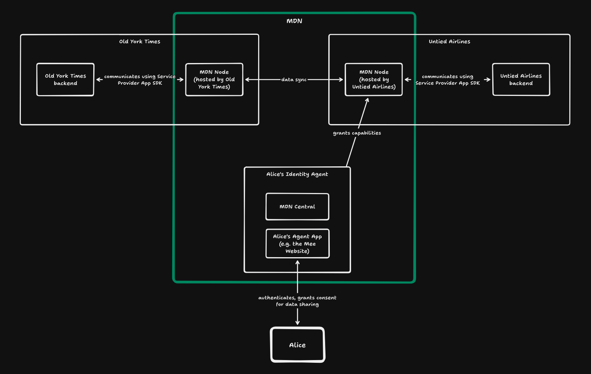

## Example Use Case

Consider a user Alice connecting to the Untied Airlines app for the first time. The app is MDN-compatible, meaning it participates in the Mee Data Network. When Alice logs in:

1. She authenticates using her Mee Identity via her Agent App (e.g. the Mee Website or the Mee Smartwallet)
2. Alice's Identity Agent grants Untied Airlines capabilities for maintaining their Identity Context (a private space for Alice's airline-related data).
3. Untied Airlines creates an Identity Context. The Identity context is owned by Alice and she retains the ability to read, update or delete the data.
4. The app queries Alice's Identity Agent for the data it requires (like the birth date or payment information).
5. Let's say Alice has previously shared payment information with Old York Times. Alice consents to sharing this data with Untied Airlines via her Agent App.
6. Alice's Identity Agent authorizes data sharing between OYT and Untied and grants the corresponding capability tokens to Untied.
7. Data flows directly between the two apps' MDN Nodes.

Here's a basic overview of participants in this flow

## Component Architecture

The MDN consists of three primary components that enable secure data sharing:

### MDN Central

Coordinates the network without accessing personal data. Maintains:

- MDN User Accounts (like Alice's, representing a Mee Identity)
- MDN Custodian Accounts (representing data holders)
- Node directory and discovery service
- Capability token distribution

MDN Central does not store personal data - it only manages the metadata necessary for network operation and coordination.

### Custodians

Each participant (user or provider) has a Custodian Account that:

- Owns one or more MDN Nodes
- Receives capability tokens
- Manages data sharing relationships

For example:

- Alice has a Custodian Account owning her phone and desktop Nodes
- OYT has a Custodian Account owning their cloud Node
- Untied Airlines has their own Custodian Account and Node

### MDN Nodes

Store and sync personal data. Types:

1. Provider-hosted (like OYT's cloud Node)
2. User-owned (in Alice's Mee Smartwallet)

Each Node:

- Belongs to exactly one Custodian
- Stores Identity Contexts
- Maintains capability tokens and handles data access
- Directly synchronises data with other Nodes

## Core concepts

### Mee Identities

A Mee Identity is represented by the User's account in the Mee Data Network. Each identity consists of:

- A unique identifier
- Authentication credentials
- Associated Custodian Accounts
- Associated MDN Nodes
- Assigned capabilities for managing Identity Contexts

The identity is known to the user and their respective Agent Apps. A Service Provider cannot have a Mee Identity.

### Identity Contexts

An Identity Context represents a relationship between a User and a Provider (or another User). Each context has its own scoped identity that is generated uniquely for each context and cannot be correlated across different contexts.
