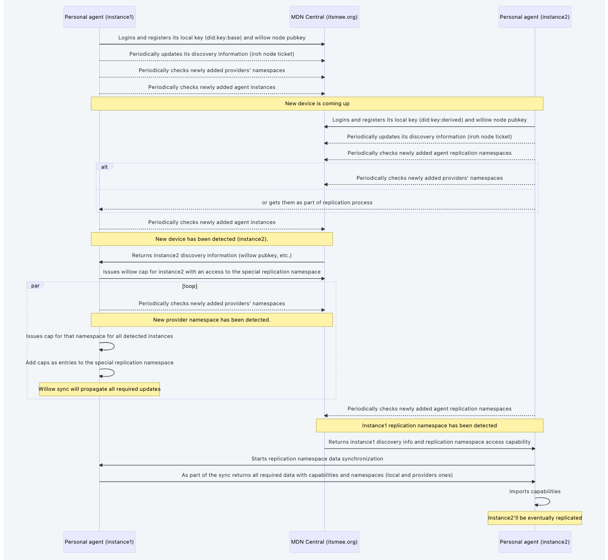

The Mee Data Network implements data synchronization between nodes through a layered architecture using [the Willow protocol](https://willowprotocol.org/) for data sync logic and [iroh](https://www.iroh.computer/) for peer-to-peer networking.

## Architecture Overview

### Protocol Stack

- MDN Layer: User control of data flows across the network
- Willow Layer: Low-level delegation and data synchronization
- iroh Layer: P2P data connections

## Network Communication

### The iroh libraries

The network layer uses two main libraries from the iroh project:

#### iroh-net

- Establishes direct connectivity between peers
- Uses QUIC protocol for connections
- Identifies connections using ed25519 keypairs
- Handles NAT traversal
- Manages fallback to relay servers when needed

#### iroh-bytes

- Manages data streaming between peers
- Built on top of QUIC protocol
- Works with content-addressed data blobs
- Verifies data integrity of each stream chunk using BLAKE3

### Establishing a connection

The system prioritizes direct peer-to-peer connections between nodes using iroh's QUIC-based networking stack.

When direct P2P connections aren't possible, the system falls back to using relay servers. These relays temporarily route encrypted traffic until a direct connection can be established, but step back if a direct path becomes available.

For specific details about connection establishment and fallback conditions, see the [iroh documentation](https://iroh.computer/).

## Synchronization Process

### Initial Device Setup

When a device joins the network:

1. MDN Central facilitates initial peer discovery
2. The device establishes connections with relevant peers
3. Synchronization begins based on capability tokens and sharing permissions

### Ongoing Sync

- Synchronization happens automatically between authorized nodes
- Uses Willow's partial sync capabilities to synchronize only relevant data subsets
- Private area intersection allows peers to determine shared data without leaking information
- All synchronization respects capability-based access controls

### Conflict Resolution

The sync system uses Willow's conflict resolution mechanism. Willow uses state-based CRDTs, which ensure eventually consistent states across nodes.

For details about partial sync constraints, private area intersection mechanics or the conflict resolution mechanism, see the [Willow specification](https://willowprotocol.org/).

Here's a detailed overview of the synchronization process

