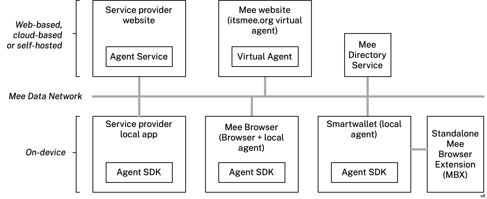

## Agent App

An application that allows the user to control their [Personal Data](#personal-data) and [Identity Agent's](#identity-agent) behavior. It could be [Mee Smartwallet](#mee-smartwallet) or [Mee Web Agent](#mee-web-agent).

## Agent App SDK

A software development kit that provides functionality needed to implement an [Agent App](#agent-app).

## Capability NEW

## Claim

An assertion made about a [subject](#subject) in a [context](#context). [Claims](#claim) have [types](#claim-type) (e.g. given-name) and values (e.g. "Fred").

## Claim Type

A type of the [Claim](#claim). Can be primitive or composite. An example of an assertion with a composite type: in assertion `&lt;person-1&gt; &lt;has-a-driver-license&gt; &lt;driver-license-1&gt;` the `driver-license-1` is a composite value. The details of claim types are to be specified.

## Connection

A data sharing relationship between a [User](#user) and a [Relying Party](#relying-party). The Connection represents a dedicated communication channel and is associated with exactly one [Identity Context](#identity-context). Multiple Connections may exist between the same [User](#user) and [Relying Party](#relying-party), provided each Connection is associated with its own unique [Identity Context](#identity-context). Connection operates using one or more data sharing [protocols](#protocol). 

Data may flow through Connection periodically or continuously. Direction of the data flow is not specified; could be unidirectional or bidirectional.

## Identity Context

A set of [Claims](#claim) about a [Person](#person) in context of relationship with [Relying Party][#relying-party], identified by a [Context-scoped identity](#context-scoped identity). Identity Context is associated with exactly one [Connection](#connection).

## Context-scoped Identity NEW

## Delegated Claim

A [Claim] of a specific [Identity Context](#identity-context) that has been conditionally shared with another [Identity Context](#identity-context). The conditions of the Claim Delegation are specified by the [Capability](#capability). It is required for the delegated claim to refer to the [User](#user) by the [Context-scoped Identity](#context-scoped-identity) associated with the specific context. In other words, if a claim is shared between context A and context B then in the context A it should refer to the user by the context-scoped identity associated with the context A. And in the context B it should refer to the user by the context-scoped identity associated with the context B. The [Identity Agent](#identity-agent) is responsible for performing substitution and resolution of context-scoped identities.

## Identity Agent REWRITE

A part of [Mee Data Network](#mee-data-network) that is responsible for managing [Connections](#connection) between [Users](#user) and [Relying Parties](#relying-party).

## Local App

An application that runs on the user's local devices (e.g. smartphone, tablet, or laptop)

## MDN License REWRITE

To operate on the [Mee Data Network](#mee-data-network) service providers must be authorized by the Mee Foundation and agree to the terms of the [MDN License](#mdn-license) agreement. This agreement licenses the user’s [personal data](#personal-data) to the [service provider](#service-provider) and states what they can and cannot do with it. For example, it requires the [service provider's](#service-provider) apps to get opt-in consent from the user before sharing/selling their data to other entities. It also requires that the [service provider's](#service-provider) apps implement MDN protocols so they can interoperate with the user’s [identity agent(s)](#identity-agent).

## Mee Browser Extension (MBX)  REWRITE

MBX is a browser extention that either (i) contains an embeded local agent deployed as a browser extension or (ii) communicates with a local agent on the same device. The browser extension may also include functions implementing the Global Privacy Control (https://globalprivacycontrol.org), third-party cookie deletion, and implementing [connections](#connection) to websites using web scraping/filling.

## Mee Data Network (MDN)  REWRITE

A network of [Mee-authorized](#mee-authorized) [apps](#apps), [identity agents](#identity-agent), and [Mee Browser eXtensions](#mee-browser-extension) that exchange [personal data](#personal-data) under the user's control. The [MDN](#mee-data-network) has exactly one [Mee Directory Service](#mee-directory-service).

## Mee Smartwallet

An [Local App](#local-app) that provides [Agent App](#agent-app) functionality and [MDN Node](#mdn-node) functionality.

## MDN Node

An app that stores [Personal Data](#personal-data) of the [User](#user) and implements the set of protocols required to synchronize the data over [Mee Data Network](#mee-data-network). It could be hosted either by the [User](#user) or by [Service Provider](#service-provider). If the MDN Node is hosted by the [Service Provider](#service-provider) it must store only the data for the [Identity Contexts](#identity-context) associated with this [Service Provider](#service-provider) (the [Identity Contexts](#identity-context) where this [Service Provider](#service-provider) is a [Relying Party](#relying-party)). 

## Mee-authorized

[Mee-authorized](#mee-authorized) is an adjective applied to a [Service Provider App](#service-provider-app) wherein the user's [personal data](#personal-data) involved in a data sharing connection with this app is subject to the terms of the [MDN License](#mdn-license). To be [Mee-authorized](#mee-authorized) an app may also have to adhere to a set of specific UI guidelines.

## Mee Directory Service REWRITE

A central directory service that maps [identity agent](#identity-agent) user ids to the user's [identity agent](#identity-agent).

## Mee Identity

An account in the [Mee Data Network](#mee-data-network) with a unique identifier, together with the information needed to prove ownership of the account (e.g. email and password, or the key pair). Mee Identity is tied to the [Self](#self) of the [User](#user) and is known only to the [User](#user) and to the [Identity Agent](#identity-agent).

## Mee Web Agent

A web-based [Agent App](#agent-app) that is hosted by Mee. It does not persist [Personal Data](#personal-data) of the [User](#user) and does not provide functionality of [MDN Node](#mdn-node).

## Personal Data

Information that identifies, relates to, or could reasonably be linked with the user or the user's household. This data include names, addresses, contact information, payment information, lists of friends, preferences, interests, medical records, etc.

## Protocol

A communications protocol used between a [User](#user) and a [Relying Party](#relying-party).

## Relying Party (RP) 

A [subject](#subject) with which the [User](#user) interacts using an [Identity Agent](#identity-agent). Relying Party may be another [User](#user) or a [Service Provider](#service-provider).

## Self

A set of [Claims](#claim) about a single [Person](#person) that represents the holistic [selfness](#selfness) of the [Person](#person) 

## Self-hosted 

A resource that is hosted on servers that an individual [User](#user) manages for themself.

## Selfness

The sameness of a person or a thing at all times or in all circumstances. The condition of being a single individual. The fact that a person or thing is itself and not something else. Individuality, personality.

## Service Provider App

A website, web service, mobile, tablet, laptop, or desktop application provided by a [Service Provider](#service-provider). A Service Provider App must provide an [MDN Node](#mdn-node) functionality.

## Service Provider App SDK

A software development kit that enables a [Service Provider App](#service-provider-app) to communicate with [MDN Node](#mdn-node) hosted by the [Service Provider](#service-provider). 

## Subject

A thing about which [claims](#claim) may be made.

### Corporation

A [subject](#subject) that represents an incorporated legal entity.

### Person

A [subject](#subject) that represents a natural person.

### Service Provider

A [corporation](#corporation) that provides a [Service Provider App](#service-provider-app) for its users.

### User

A [Person](#person) with [Mee Identity](#mee-identity).
 
## Whoness

A distinct impression of a single person or thing presented to or perceived by others. A set of characteristics or a description that distinguishes one person or thing from other people or things.
