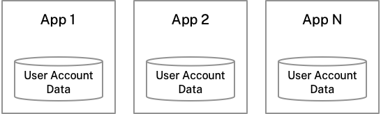
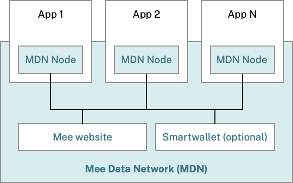

# The Mee Experience

Mee represents a human-centered user experience for the internet that puts you in control of your personal information. When you see the Mee logo on an app or website, it means that service is committed to protecting your privacy and giving you control over your data.

## Benefits of using Mee-compatible apps

### Control over your data

- No more repetitive form-filling
- See exactly what information each app has about you
- Update your information once to update it everywhere
- Delete your data from any app instantly

### Real privacy protection

- Apps cannot share or sell your information without your permission
- Your online activities stay private from tracking and surveillance
- Clear notifications when an app requests to share your data
- Simple yes/no choices instead of confusing privacy policies

## How it works

The Mee experience is enabled by:

- **The Mee Data Network (MDN)**: A secure network that allows your personal information to flow privately between Mee-compatible apps with your consent
- **The MDN License**: A legal agreement that all Mee-compatible apps must sign, ensuring they handle your personal information responsibly
- **The Mee Foundation**: A nonprofit organization that develops the technology and enforces the privacy rules

### The standard approach

Today, your personal information is scattered across hundreds of apps and websites, each maintaining their own separate copy of your data:

From the user's perspective, this standard approach has several disadvantages:

- You have to manually enter and update your information in each individual app
- You often can't see what information apps have about you
- It's difficult to control how apps share or sell your information
- Moving your data between apps is complicated or impossible
- The way you delete your data is different for each app, and often involves lengthy obscure procedures like conversations with support

### The Mee architecture

In the Mee architecture we replace the app's internal user account database with a Mee Data Network node.

The app still stores and accesses your information, but with a few crucial differences:

- Seamless and secure data sharing - you don't need to fill in the same forms multiple times
- You have full control over the data you share with each app
- You have the ability to access, update, or delete your information at any time
- The apps cannot share or sell your data without your explicit consent
- The apps agree to the MDN License, which legally requires them to respect your privacy

## Understanding Your Data

### What counts as "your data"?

Your data includes both information you directly provide (name, email, preferences, etc.) and information apps create about you (purchase history, medical records, browsing patterns, etc.).

If it's about you, it's your data - regardless of who typed it in.

### Who can access your data?

- **You**: Through the Mee website or Smartwallet
- **Apps you use**: Only the specific data they need, only with your explicit consent, only while you let them

Under the MDN License, apps are forbidden from selling your data to advertisers or otherwise sharing it with third parties without your approval.

### Where is my data stored?

When you use Mee-compatible apps, your personal information is stored:

- **With Mee-compatible apps**: Each app stores only the information it needs to provide its service. Because they store it in a Mee Network Node, you always retain full control over the data.
- **Optionally on your devices**: If you choose to install the Mee Smartwallet, it maintains an encrypted copy of your information locally

Note: **The Mee Foundation does not store or access your data.** We store only what's needed to authenticate users and the minimum technical data needed to run the network itself.

## Controlling Your Data

You can interact with your data and manage your connections with Mee-compatible apps through two interfaces

### [Mee Website](https://itsmee.org/)

The Mee website provides a simple way to get started without installing anything. After creating an account, you'll see a dashboard showing all your Mee connections. The website lets you view what information apps have about you, control data sharing between apps, and manage your connections.

### Mee Smartwallet App

The Smartwallet is an optional app you can install on your devices for enhanced privacy and convenience. It stores an encrypted copy of your data locally and lets you use your device's biometric security (like fingerprint or face recognition) for quick access. The Smartwallet provides the same connection management features as the website, plus additional privacy features and offline access.

You can use either option or both - they'll stay in sync and show the same information.

## Frequently Asked Questions

### How can I be sure that my information is secure?

Mee-compatible apps protect your information through multiple layers:

- **Encryption**: Your information is always encrypted when stored or shared
- **Access Control**: You explicitly approve what information apps can access
- **Legal Protection**: Apps must sign the MDN License, legally binding them to respect your privacy
- **Transparency**: All Mee technology is open source, allowing security experts to verify the privacy protections
- **Oversight**: The Mee Foundation monitors compliance and can revoke access from misbehaving apps

### What makes an app "Mee-compatible"?

Apps that display the Mee logo have:

- Integrated with the Mee Data Network
- Signed the MDN License
- Passed the Mee Foundation's security and privacy requirements
- Committed to never share or sell your data without explicit consent

### Is the Mee Experience free?

Yes! The Mee Foundation is a nonprofit organization funded through donations and grants. We're committed to making privacy-respecting technology freely available to everyone.

### How do I start using Mee?

The Mee project is still in active development. Join our waitlist [here](waitlist.html) to be notified when more Mee-compatible apps become available.

In the future, you'll be able to look for the Mee logo when using apps and websites. When you see it, you'll know that service respects your privacy and gives you control over your data.

### Where can I find out more?

- Read our [technical documentation](https://mdn.mee.foundation/docs/developers/mdn/)
- Browse the code on [Github](https://github.com/MeeFoundation/)

### Need Help?

- Email: [support@mee.foundation](mailto:support@mee.foundation)
- Join our Discord community: [discord.gg/mee](http://discord.gg/mee)
