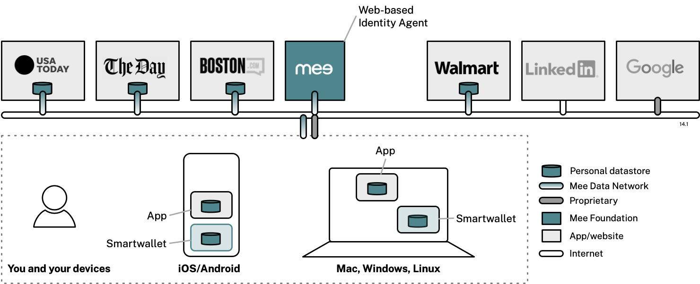

The MDN is a data network of compatible apps/sites where the information held by them is controlled by your identity agent. This agent is a free website hosted by the Mee Foundation that controls what apps/sites know about you. It is like a digital twin of you and acts as a remote control for your data. The agent keeps track of what *kinds* of attributes app/sites hold about you (e.g. your first name), but not the actual attribute *values* (e.g. "Paul"). 

You can choose to install an MDN-compatible smartwallet that stores attribute values on your mobile or desktop device. This data is never shared with the Foundation, and it is only shared with other parties with your explicit consent. 

The Mee identity agent and MDN are under development, so there is nothing for you to play with quite yet. When it's ready you'll be able to sign up for an account on the Mee website (planned for itsmee.org) and optionally install the Mee Smartwallet app. 

